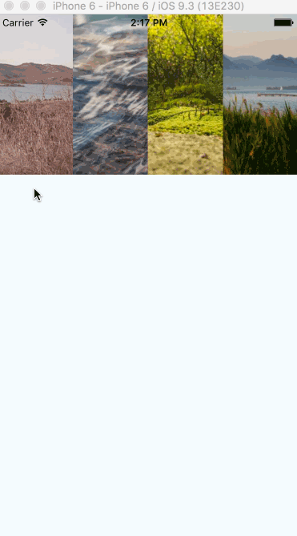

# react-native-image-viewer (iOS only)

Displaying multiple images in fullscreen mode that you can swipe through.

## Installation

```
npm install react-native-image-viewer --save
```

## Features

1. Swipeable images in fullscreen mode
2. Pinch to zoom

## Usage

You should provide those props to the Component:

1. `modalVisibility` {Boolean} - decide whether to show the modal
2. `closeModal` {Function} - close modal
3. `navigationState` {Object} - its' used with [NavigationExperimental](https://github.com/facebook/react-native/tree/master/Libraries/NavigationExperimental).

    You `navigationState` will looke like this:

        ```
        {
          index: 0,
          routes: [
            {
              key: '1',
              url: 'https://example.com/image.png',
              size: 1000
            }
          ]
        }
        ```
    You should specify width of the image by `size`, it's used to define how large you can zoom the image.

Check the [example](https://github.com/chenxsan/react-native-image-viewer-example/blob/master/index.ios.js) repository.

## Screenshot



## Code style

use [standardjs](http://standardjs.com/).

## TODO

[ ] add test